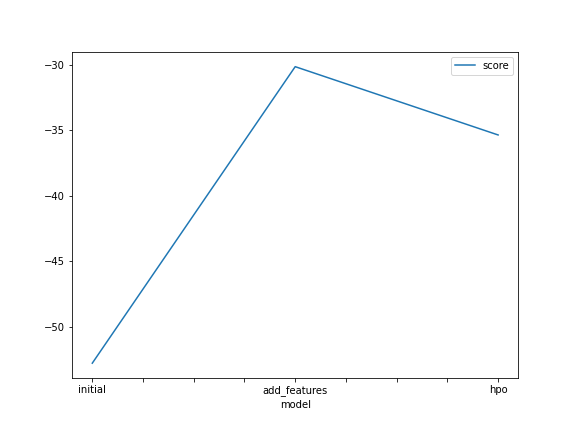
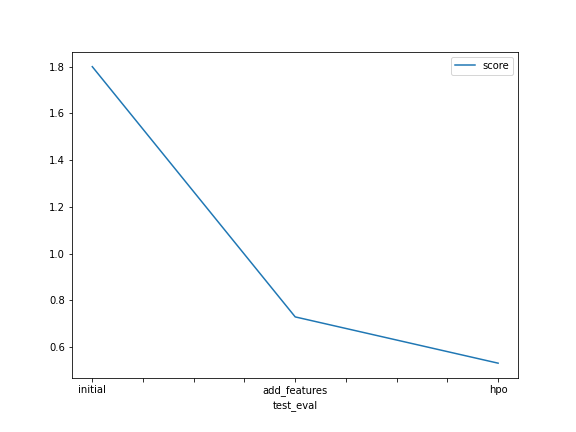

# Report: Predict Bike Sharing Demand with AutoGluon Solution
#### Paula Pipkin

## Initial Training
### What did you realize when you tried to submit your predictions? What changes were needed to the output of the predictor to submit your results?
TODO: I actually didn't have negative results, my first min was 3.07

### What was the top ranked model that performed?
TODO: For the first try the best model was WeightedEnsemble_L3, a model that combines the predictions from multiple models.

## Exploratory data analysis and feature creation
### What did the exploratory analysis find and how did you add additional features?
TODO: The features had different types of distribuition,but they all seemed to make sense. I created a time column from the datetime feature using dt.time after converting 'datetime'to  datetime using pd.to_datetime

### How much better did your model preform after adding additional features and why do you think that is?
TODO: the second try scored 0.965193 (5.5% better), I believe that not only adding the feature but also setting the dtype to category for some features gave the more information about the features and helped improved how they were used in the prediction

## Hyper parameter tuning
### How much better did your model preform after trying different hyper parameters?
TODO: my top ranked model actually had a slightly lower score (0.964358) but, the predictions were much better. I went from 1.76108 to 0.47090 on kaggle, where the lower score is the best in this case.

### If you were given more time with this dataset, where do you think you would spend more time?
TODO: I would try different hyper parameters and also try to better understand why such a small change in the score "for the worse" could resulte in a much better prediction (from 2nd to 3rd run)

### Create a table with the models you ran, the hyperparameters modified, and the kaggle score.
|model|Best Quality|More Features|Hyper Parameter|score|
|--|--|--|--|--|
|initial|True|False|False|1.79514|
|add_features|True|True|False|1.76108|
|hpo|True|True|True|0.47090|

### Create a line plot showing the top model score for the three (or more) training runs during the project.

TODO: Replace the image below with your own.

### Create a line plot showing the top kaggle score for the three (or more) prediction submissions during the project.

TODO: Replace the image below with your own.

## Summary
TODO: During this project I experienced using AutoGluon. I had to review the individual parameters for the main models so I could use them do indiviadully tune my last run, and that result and much better predictions.Even though, tunning can take a good ammount of time, Auto Gluon definitely makes the work easier, because once the parameters are set, AutoGluon will run and evaluate each model 'at once'.

Independently of the tunning, for all 3 runs a WeightedEnsemble, a model that combines the predictions from multiple models, was ranked the best.

I also learned the importance of correctly set the correct type for each feature to help the model understand the weight of each feature.

